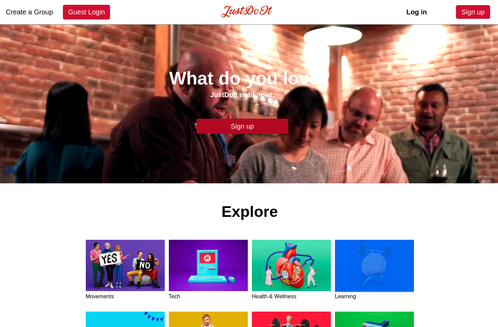
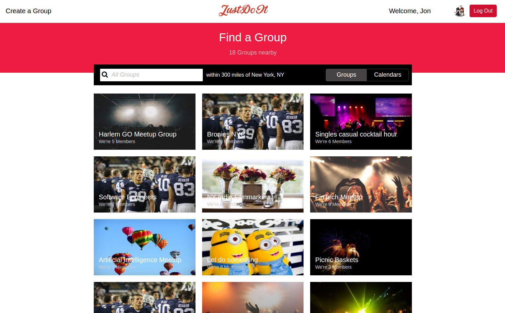
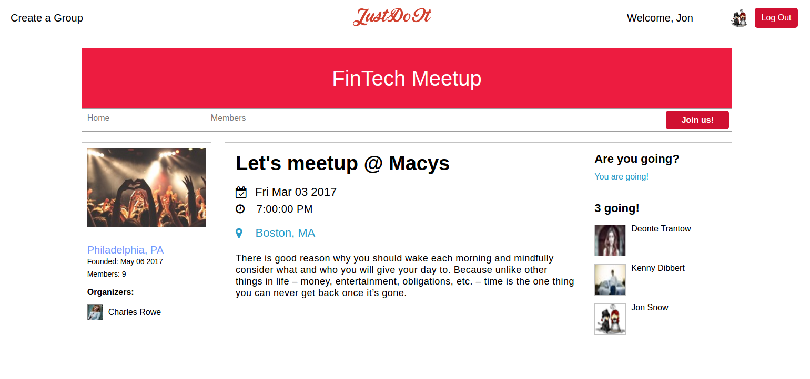

# JustDoIt

[JustDoIt Live][heroku]

[heroku]: http://www.just-doit.us/#/

JustDoIt is a web application inspired by Meetup. It utilizes Ruby on Rails on the backend, a PostgreSQL database, and React.js with a Redux architectural framework on the frontend.

## Features & Implementation

* JustDoIt!
  - Join groups and rsvp to events
  - See events of the groups
  - See members of the group




* Groups
  - Users can join a group
  - Users can view, create and destroy individual group
  - Users can see other group members


  


* Events    
  - Users can RSVP to an events
  - Users can view, create and destroy events
  - Users can see attending list


  


* Search Bar   
  - Users can search for group based on groups' name, location and description

  ```javascript
    handleSearch(e){
      const query = e.target.value;
      clearTimeout(this.searchTimeout);

      this.searchTimeout = setTimeout(() => {
        this.props.searchGroup({ search: query });
      }, 100);
    }
  ```


* Authentication
  - Secure custom authentication system that hashes/salts passwords using BCrypt

  ```ruby
    def password=(password)
      @password = password
      self.password_digest = BCrypt::Password.create(password)
    end

    def is_password?(password)
      BCrypt::Password.new(password_digest).is_password?(password)
    end
  ```

## Future Directions for the Project

### Categories
  - [x] Users will be able to navigate to a category page that filter out all groups based on the selected category

### Infinite Scrolls
  - [ ] Users will be able to scroll through their groups and events and the server will send out a new set of groups and events starting from the last offset

### Calendar
  - [ ] Users will be able to search and sort for events based on date
